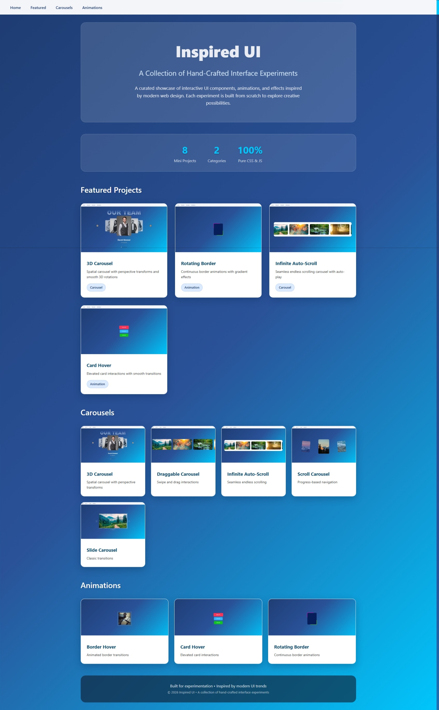
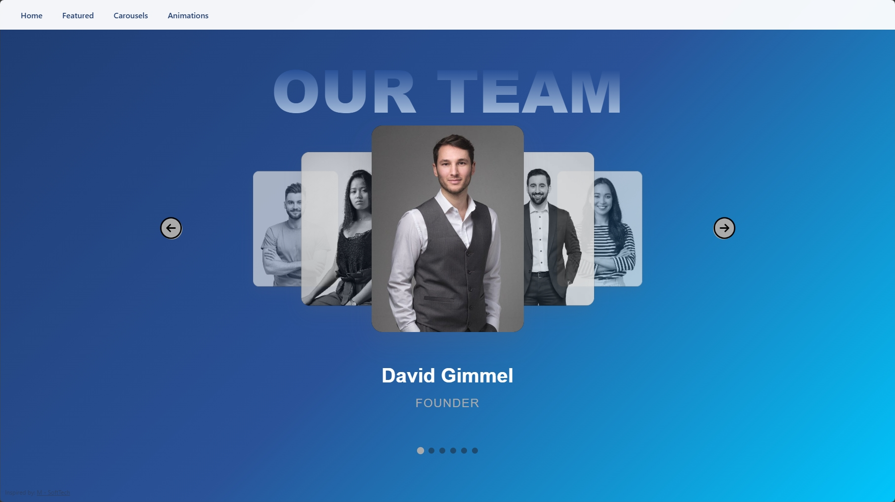
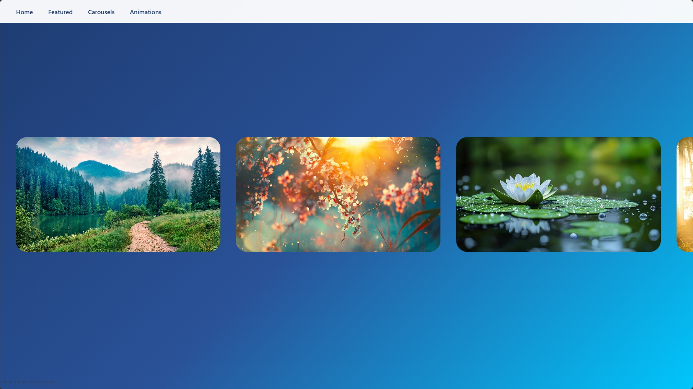
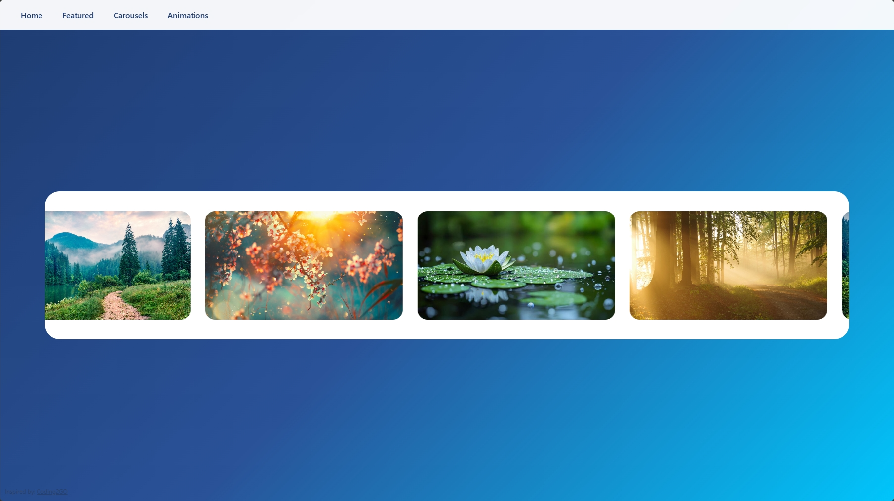
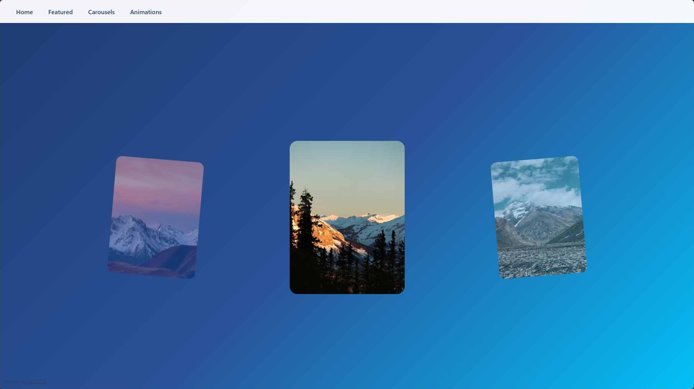
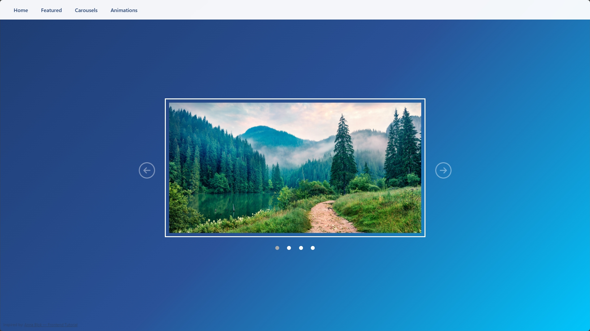
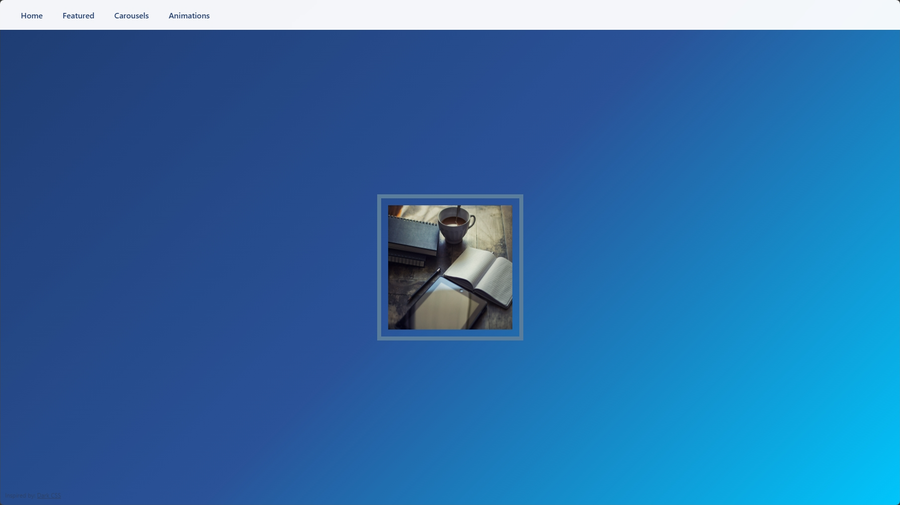
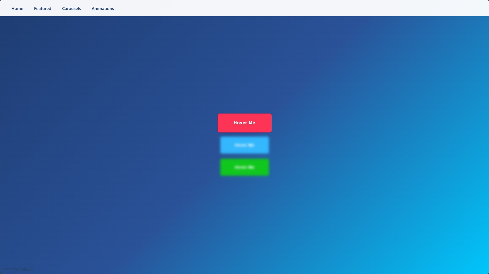
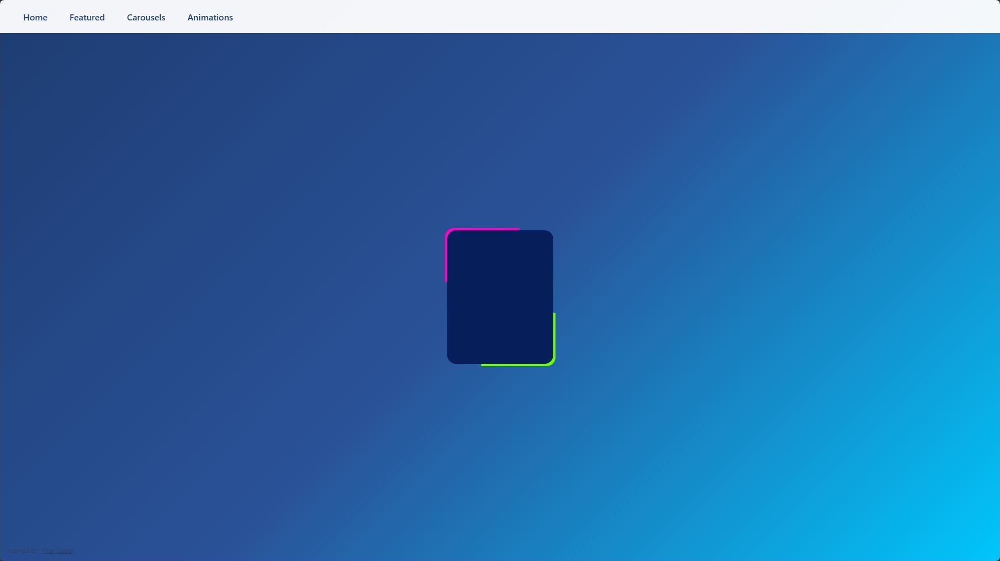

# Inspired UI 🌟

A curated collection of interactive UI components and mini-projects inspired by modern web design trends. Each component is built with pure HTML, CSS, and JavaScript — no frameworks, no libraries, just vanilla code that's easy to understand, modify, and integrate.

## Features ✨

- **Central Navigation** – One main hub to explore all mini-projects
- **Self-Contained Components** – Each project has its own HTML, CSS, and JS
- **Zero Dependencies** – 100% vanilla JavaScript
- **Fully Responsive** – Adapts seamlessly to all screen sizes
- **Modern UI Patterns** – Showcases current web design trends and interactions
- **Easy Integration** - Grab any component and drop it into your existing projects

## Mini Projects

### Home Page 📱

Central navigation hub that links to all mini-projects.

### 3D Carousel 💠

A 3D card carousel with multiple navigation methods:

- Swipe gestures
- Click on cards
- Arrow buttons
- Dot indicators
- Keyboard arrows

### Draggable Carousel ↔️

Smooth drag-and-drop carousel controlled by mouse movement.

### Infinite Auto Scroll Carousel ♾️

Endlessly scrolling carousel that pauses on hover.

### Scroll Carousel 🖱️

Navigate using mouse scroll wheel or keyboard arrows.

### Slide Carousel ⬅️➡️

Traditional slide carousel with arrow buttons and dot navigation.

### Border Hover 🔳

Elegant animated border effect on hover.

### Card Hover 💳

Interactive hover effect that highlights the selected card while blurring others.

### Rotating Border 🔄

Continuous rotating border animation effect.

## Key Concepts Used 🧩

**JavaScript**

- **DOM Selectors**: `getElementById()`, `getElementsByClassName()`, `querySelector()`, `querySelectorAll()`
- **DOM Manipulation**: `textContent`, `style.opacity`, `classList.add()`, `classList.toggle()`
- **Events**: `.addEventListener()`, mouse/touch events, keyboard events
- **Math**: `abs()`, `.max()`, `.min()`, `.parseFloat()`
- **Array Methods**: `forEach()`
- **Advanced**: `dataset`, `insertAdjacentHTML`, `animate()`, `scrollBy()`
- **Touch Events**: `changedTouches[0].screenX`
- **Keyboard Events**: `e.preventDefault()`
- **Window Properties**: `innerWidth`, `clientWidth`, `onmouseup`, `onmousedown`

**CSS**

- **Gradients**: `linear-gradient`, `conic-gradient()`
- **Visual Effects**: `background-clip`, `transform-style`, `rotate()`
- **Interactivity**: `pointer-events`, `user-select`
- **Layout**: `flex-shrink`, `inset`
- **Scroll Behavior**: `scroll-snap-type`, `scroll-snap-align`, `scrollbar-width`
- **Animations**: `animation-timeline`
- **Typography**: `letter-spacing`
- **Borders**: `outline-offset`

**HTML**

- **Custom data attributes**: `data-mouse-down-at`, `data-prev-percentage`

## Programming Languages Used 🛠️

- HTML
- CSS
- JavaScript

## Screenshots 📸

### Home Page 📱

### 3D Carousel 💠

### Draggable Carousel ↔️

### Infinite Auto Scroll Carousel ♾️

### Scroll Carousel 🖱️

### Slide Carousel ⬅️➡️

### Border Hover 🔳

### Card Hover 💳

### Rotating Border 🔄

## Acknowledgments 🙏

These mini-projects are inspired by UI/UX designs from:

- YouTube tutorials and coding channels
- Modern web applications and interfaces
- Frontend development communities
